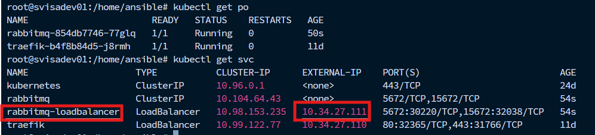
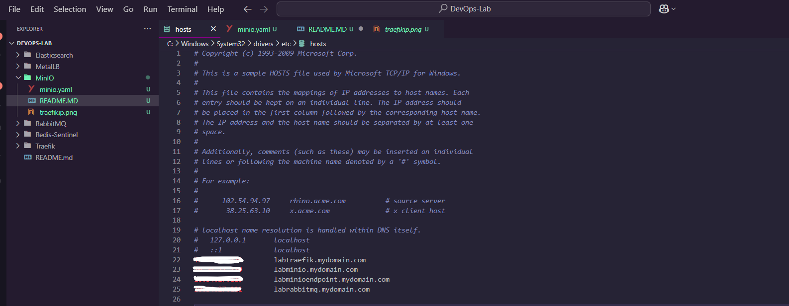

# RabbitMQ Kubernetes Installation Guide

This guide will help you set up RabbitMQ in a Kubernetes environment. We will expose RabbitMQ using a `LoadBalancer` service through MetalLB, and we will explain step-by-step how to access the RabbitMQ management interface.

## 🧱 Requirements

Before starting, make sure the following requirements are met:

- A running Kubernetes cluster.
- `kubectl` is installed and configured to communicate with your cluster.
- MetalLB is installed so that we can get an external IP.
- You should have permission to modify your DNS or `hosts` file.

## ⚙️ Step-by-Step Installation Instructions

### Step 1: Apply the RabbitMQ Deployment

1. First, apply the RabbitMQ YAML configuration to your Kubernetes cluster. This will create the necessary resources for RabbitMQ.

   Run the following command:

   ```bash
   kubectl apply -f rabbitmq.yaml


2. Then let's find out the ip address of the rabbitmq-loadbalancer service in kubectl get svc 



3. If we are not working in an environment without a DNS server, this is how we will add it to our own host file, the path of this file in the window is like this ( C:\Windows\System32\drivers\etc\hosts ).



4. Now we can access the dashboard by going to the url labrabbitmq.mydomain.com:15672 through the browser.


